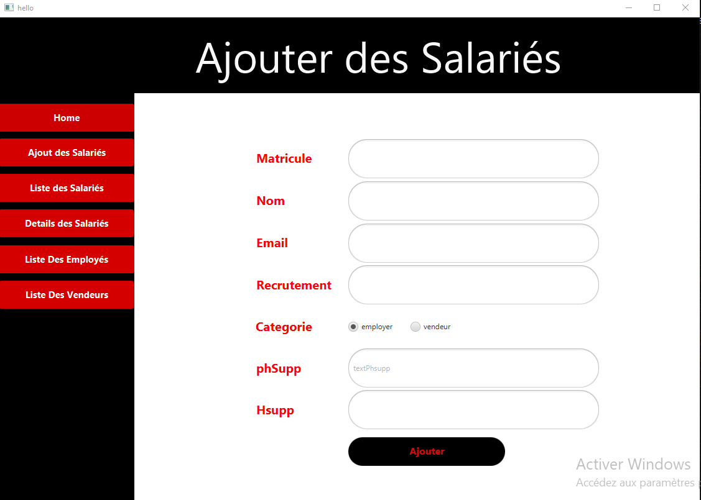
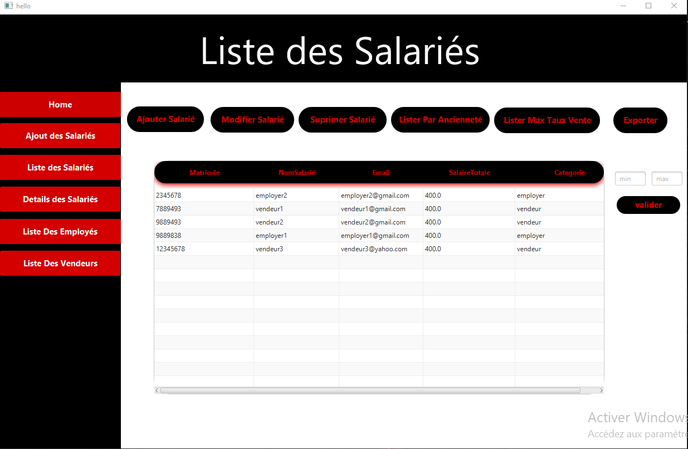
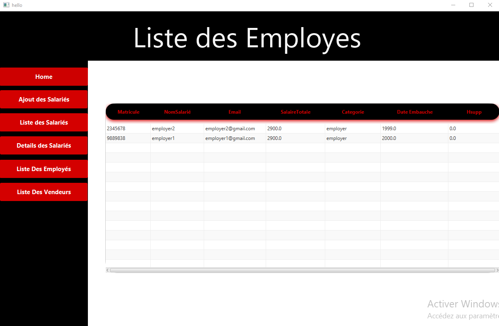
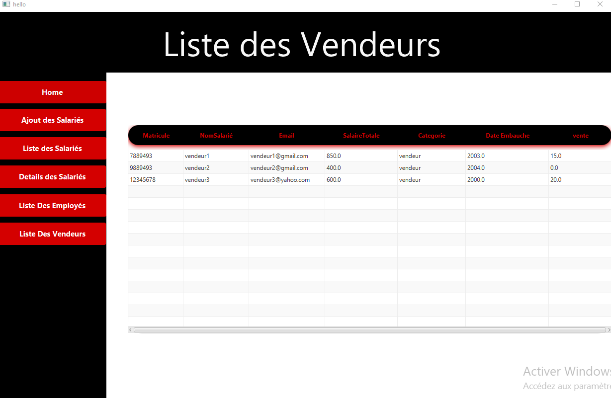
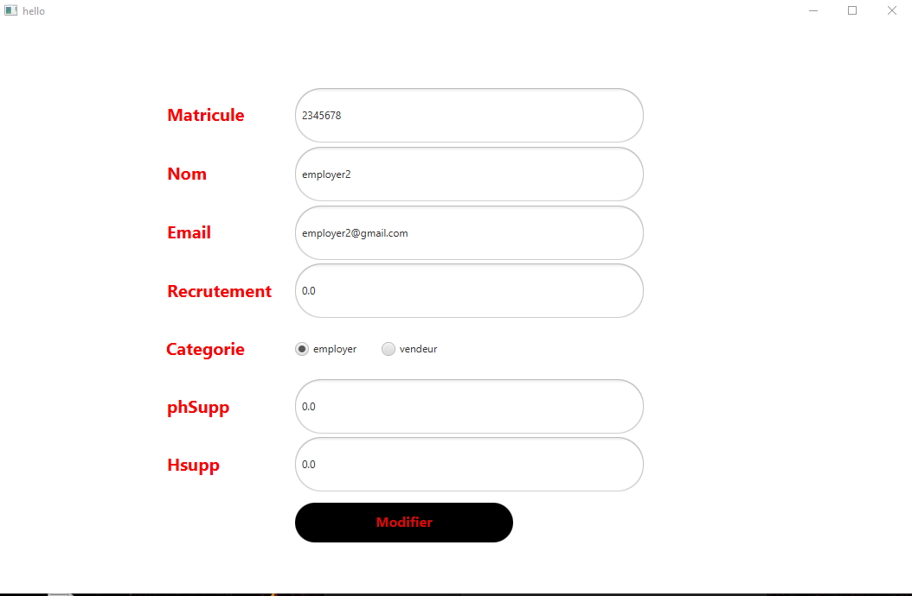

# ProjetJavaFX
Employees Managment

    
    
    
    
    
  
  

# features
1. View the list of employees: the application should display the employee ID, name, email, category (employee or seller), and salary for each employee.
2. Manage the list of employees (add, modify, delete)
3. Display the details of an employee (ID, name, email, salary, hire date, overtime hours for employees and sales rate in dinars for sellers)
4. List employees by category
5. List employees by seniority
6. List employees whose salary is between two values
7. List sellers with the highest sales rate
8. View the list of employees with the lowest salary
9. Export the list of employees to an external file.
